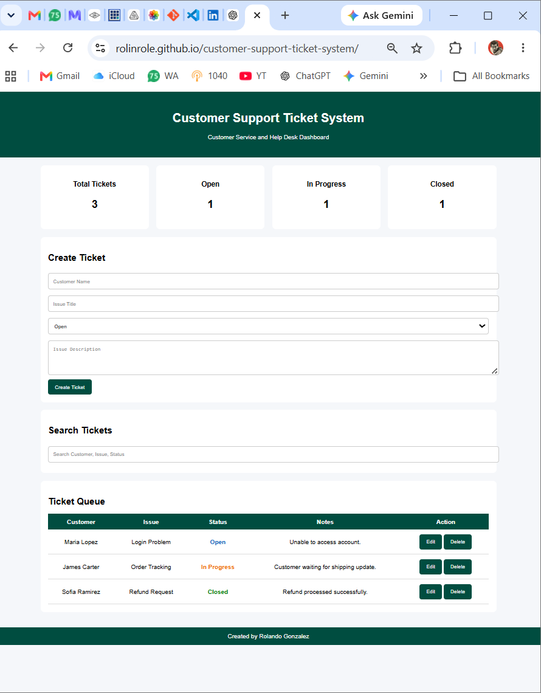

# Customer Support Ticket System

Live Site: https://rolinrole.github.io/customer-support-ticket-system/

## Screenshot

A customer service and help desk dashboard built with HTML, CSS, and JavaScript.

## Features

- Create support tickets
- Search tickets
- Track ticket status
- Dashboard metrics
- Customer issue management
- Ticket queue management

## Technologies

- HTML5
- CSS3
- JavaScript
- Git
- GitHub
- GitHub Pages

## Skills Demonstrated

- Customer Service
- Technical Support
- Help Desk Operations
- Issue Tracking
- Dashboard Development
- Front End Development

## Author

Rolando Gonzalez

Portfolio:
https://www.randommedia.net/

GitHub:
https://github.com/rolinrole